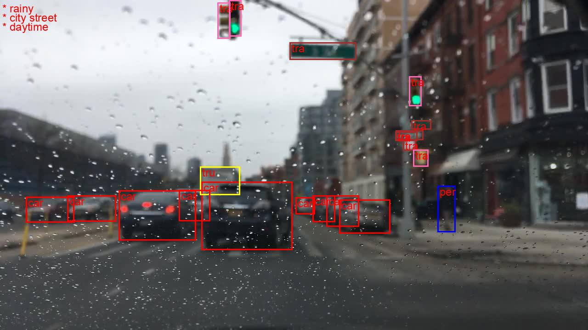

# BDD detection Dataset Model (YOLOv5)
YoloV5 Detection model for detection on BDD-dataset.




### Pre-trained models benchmarch
| # |  MODEL      | Backbone  | AP (Box) |
|---|-------------|-----------|----------|
| 1 | Faster RCNN | R-101-FPN |  32.61   |
| 2 | RetinaNet   | R-101-FPN |  31.29   |
| 3 | Cacase RCNN | R-101-FPN |  33.57   |
| 4 | FCOS        | R-50-FPN  |  30.13   |
| 5 | DCovNets-v2 | R-50-FPN  |  33.21   |
| 6 | Libra-RCNN  | R101-FPN  |  32.24   |
| 7 | HRNet       | w32       |  33.97   |
| 8 | ATSS        | R-101-FPN |  33.80   |
| 9 | Sparse RCNN | R-101-FPN |  32.18   |
|10 | DyHead      | R-101-FPN |  34.61   |
|11 | Swin-T      | C-RCNN    |  35.95   |
|12 | PVT         | S         |  31.23   |
|13 | PVT2        | B2        |  32.98   |
|14 |R-StrikesBack| R-50-FPN  |  32.48   |
|15 | ConvNext-S  | C-RCNN    | `36.11`  |

We see here the winner is `ConvNext-S` model with AP = 36%, but one model which is not mentioned here claims to be having AP more than 40% which is [`YoloV5`]("https://github.com/williamhyin/yolov5s_bdd100k") with `s` variant which is much smaller than resnet-50 in no of parameters.

## Analysis
- Dataset: [notebooks/data_analysis.ipynb](notebooks/data_analysis.ipynb)
- Model: [notebooks/model_selection.ipynb](notebooks/model_selection.ipynb)
- Prediction: [notebooks/pred_analysis.ipynb](notebooks/pred_analysis.ipynb)

## Usage
Checkout usage [documentation](https://danishansari.github.io/bdd_det_yolo/source/main.html).

## Dataset
- [Download](https://drive.google.com/file/d/1NgWX5YfEKbloAKX9l8kUVJFpWFlUO8UT/view) this dataset onto your local device.

## Dependencies
checkout `pyproject.yaml` for more

    - python-3.11
    - torch-2.2.0+cu121
    - ultralytics

__Note:__ modify `config/bdd-data.yaml` and pass data-path with `-d/--data-path` argument for `train`/`eval`/`infernce`/`visualize`.

## Setup
```
    git clone https://github.com/danishansari/bdd_det_yolo.git
    cd bdd_det_yolo/
```
### 1. Docker
```
    docker build -f docker/Dockerfile -t bdd-yolo:latest .

    docker run --rm -v $(pwd):/yolo-bdd -v /path/to/bdd-root-dir:/dataset -it bdd-yolo:latest
```
### 2. Conda & Poetry
```
    conda create -n bdd-yolo python==3.11
    conda activate bdd-yolo

    sudo apt install python3-poetry 
    poetry install
```

## Training (docker)
```
    python -m scripts.train -b/--bach <batch-size, default=1> -e/--epochs <num-epochs, default=1>
```

## Benchmark (docker)
```
    python -m scripts.eval
```

## Dataset visualization (docker)
```
    python source/main.py -t/--task <data-viz/plot-viz/eval/infer>
```
- data-viz: visualize image with grond truth annotations; saves image in plots/images/tmp.jpg
- plot-viz: saves data stats in plots directory
- eval: performs evaluation of models on different attributes
- infer: performs model infernece in val dataset and overlayes predections and saves in plots/images/tmp.jpg

## [Documentation](https://danishansari.github.io/bdd_det_yolo/source/index.html)
```
    pdoc --html source -o docs
```

